# CampingsFrontend

## Athens University of Economics and Business ([AUEB](https://aueb.gr/)) 🏫 👨‍🎓
A [Coding Factory](https://codingfactory.aueb.gr/) @ [AUEB](https://aueb.gr/) Final Web Project. Angular - Typescript - Campings frontend site. ⛺⛺⛺

## Description
The Camping Frontend is a web application developed using Angular framework on the front-end and Java on the back-end. The back-end is provided on the [campings-backend](https://github.com/KountourisPanagiotis/campings-backend/blob/main/README.md) repository. The front-end provides a user-friendly interface for managing bookings, customers, staff, campings, payments, emplacements and categories, across many camping establishments. The system allows users to perform various operations such as creating, updating, and deleting records, as well as viewing ***live*** statistics and reports.

## Preview
<table>
  <tr>
    <td>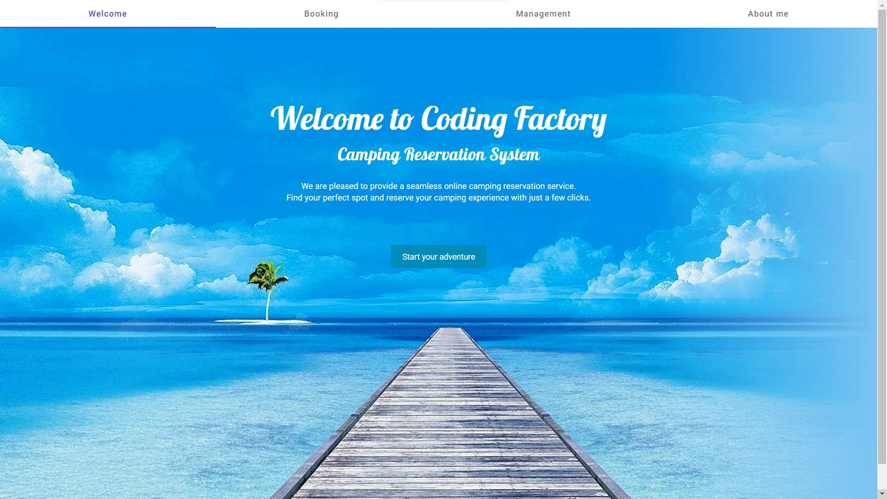</td>
    <td>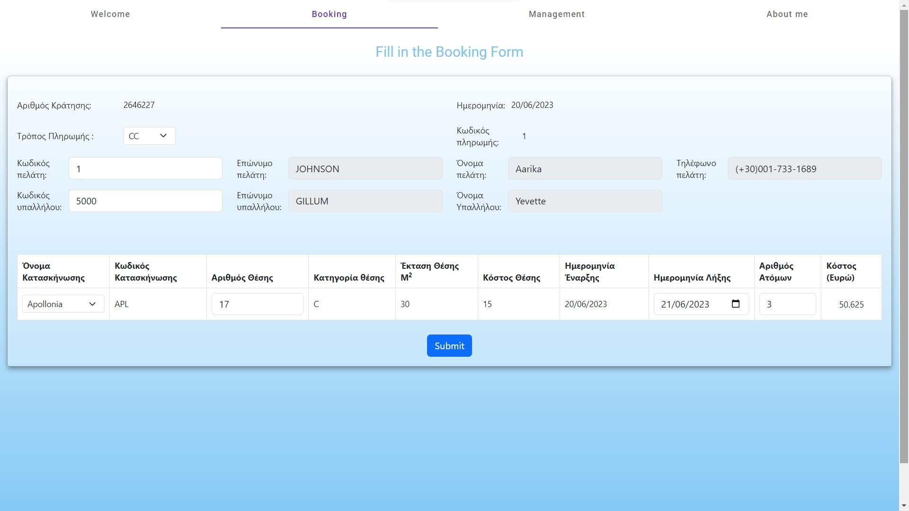</td>
    <td>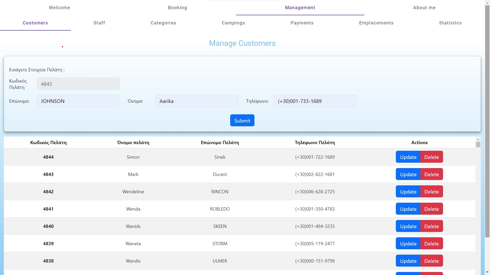</td>
  </tr>
  <tr>
    <td>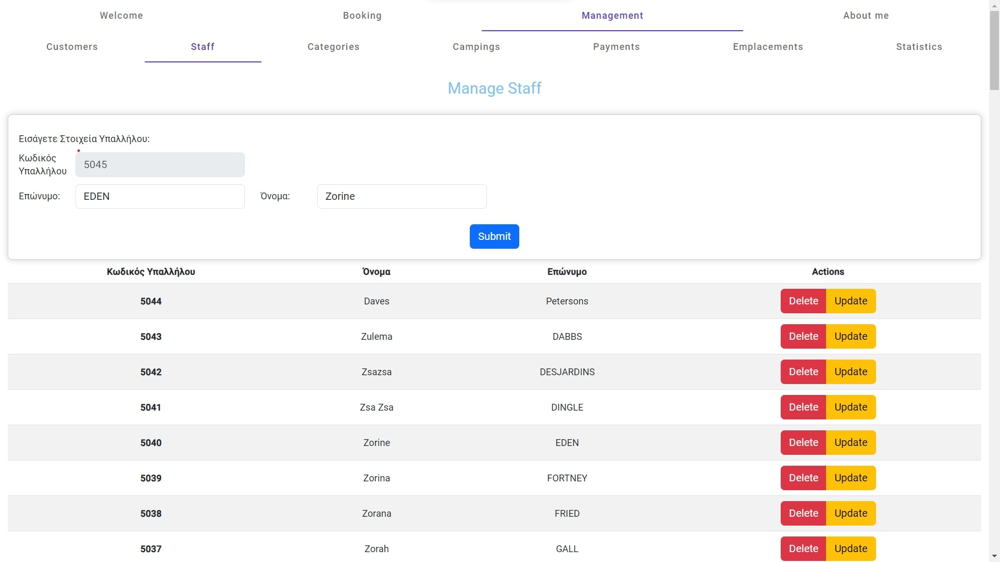</td>
    <td>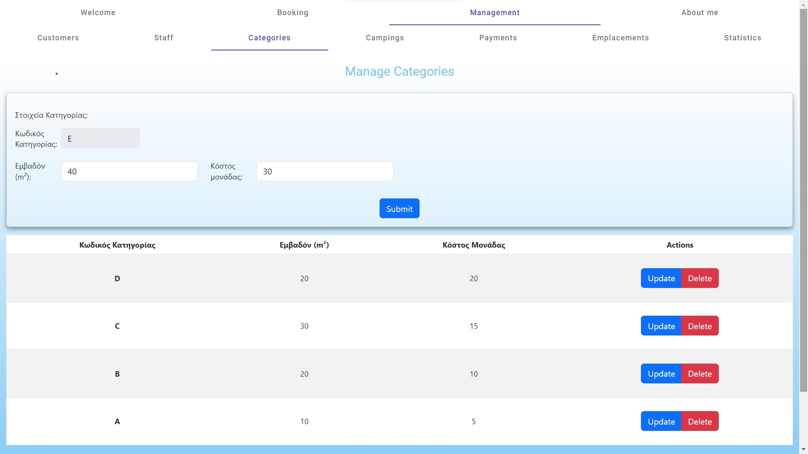</td>
    <td>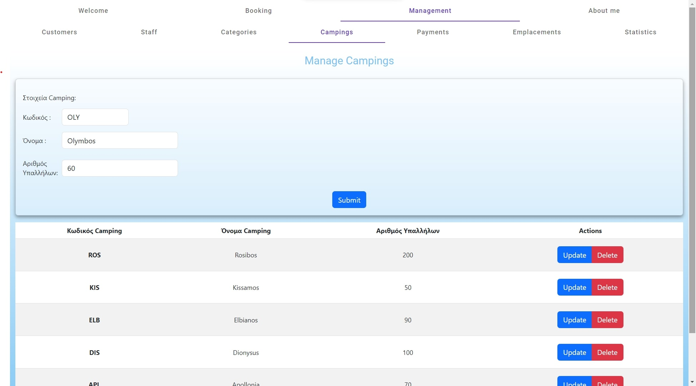</td>
  </tr>
  <tr>
    <td>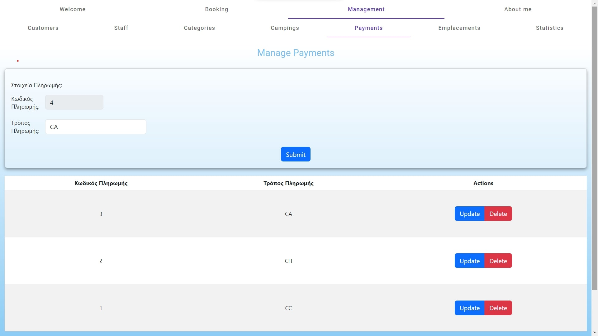</td>
    <td>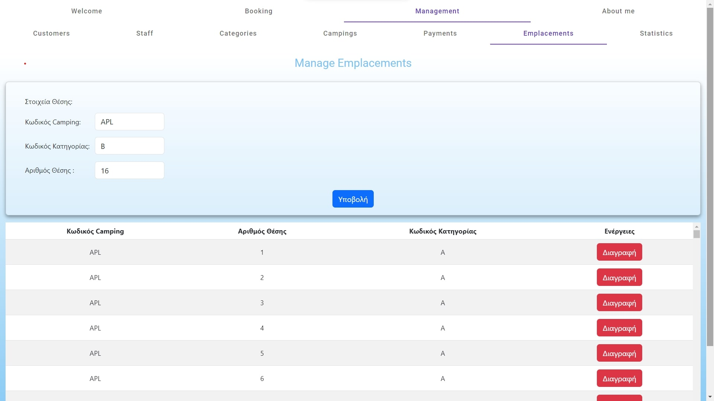</td>
    <td>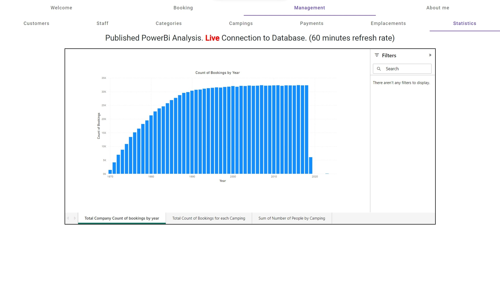</td>
  </tr>
  <tr>
    <td>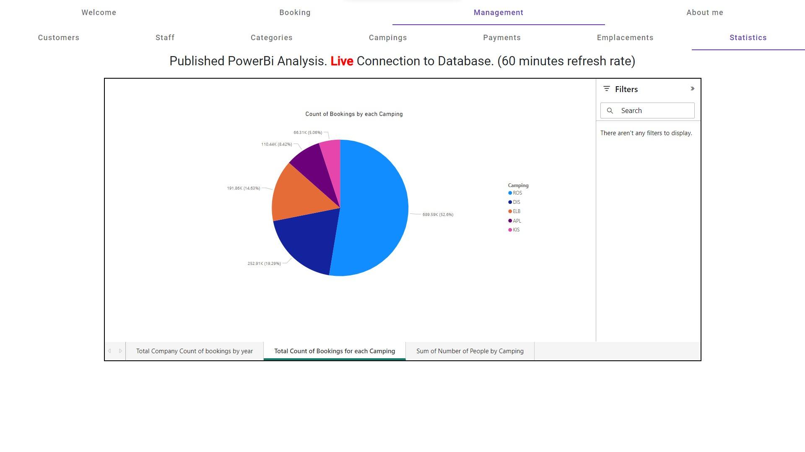</td>
    <td>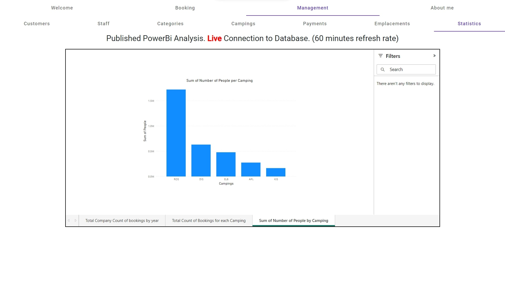</td>
    <td>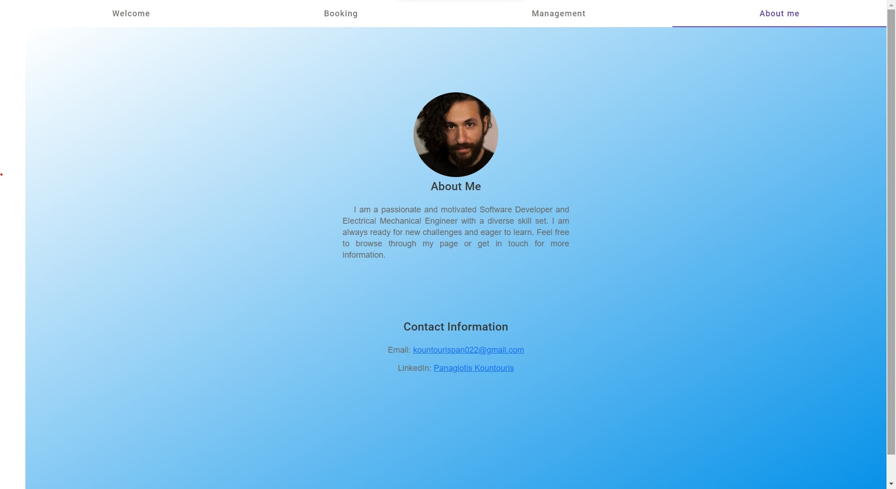</td>
  </tr>
</table>

The site is hosted live on github pages [here](https://kountourispanagiotis.github.io/campings-frontend/)


## Features
- 📈 Statistics: Generate Live Power Bi statistics and reports for bookings and payments. Live connection to database. 60 mins refresh rate.
- 💙 Quality of life feature: In order to minimize errors, the user-input is mainly executed through dropdown-lists.
- 📖 Booking Management: Create and manage booking for customers. (Each booking may consist of many emplacement spot arrangements)
- 🧔 Customer Management: Manage customer information.
- 👷 Staff Management: Add and update staff members.
- 🏕️ Campings Management: Add, update, and delete different company camping establishments.
- 💵 Payment Management: insert or alter payment methods.
- Category Management: Manage different categories for camping spots.
- Emplacements Management: Management of combination of campings and categories for all the company through a unified system. 


## Technologies Used

- Front-end: ***Angular*** 15.2.8
- Back-end: ***Java*** 11.0.16.1
- Database: ***MySQL***
- Styling and Responsive Design: ***Bootstrap***
- UI extra tools Framework: ***Angular Material***
- ***Node.js***: v18.13.0
- ***npm***: v8.19.3
- ***RxJS***: 7.8.1
- ***TypeScript***: 4.9.5

## Additional Notes
- ***Angular Material Modules*** : The project utilizes various modules from Angular Material for UI components and styling.
- ***HttpClientModule*** : The HttpClientModule is used for making HTTP requests to communicate with the back-end services.
- ***RouterModule*** and ***Routes*** : The application utilizes the RouterModule to define and configure the application routes. The routes array in the app.module.ts file specifies the different paths and their corresponding components.
- ***MatSnackBarModule*** : The MatSnackBarModule from Angular Material is used for displaying pop-up messages (snack bars) in the application.
- ***ScrollingModule*** : This project uses the ScrollingModule to optimize the speed of rendering large tables, by rendering only the items currently in view.
- ***MyBaseUrlService*** : This service provides the base URL for the backend API. Adjust the URL in ***src/app/services/my-base-url/my-base-url.service.ts*** file to match your backend setup.

## Prerequisites

Before running the application, make sure you have the following software installed:

- Node.js: v18.13.0. Install Node.js from the official website.
- Angular CLI: v15.2.8. Install Angular CLI globally using npm.
- npm: v8.19.3. Usually comes with Node.js installation.
- Java Development Kit (JDK): OpenJDK version "11.0.16.1" 2022-08-12 LTS
- MySQL: Install and configure MySQL for the database.

## Getting Started
## Installation

Follow the steps below to set up and run the application:

1. Clone the repository:
```
git clone https://github.com/KountourisPanagiotis/campings-frontend.git
```
2. Front-end Setup
  - Navigate to the campground-management-system/frontend directory.
  - Install dependencies using npm:
```bash
npm install
```
  - Adjust the base URL:Open ***src/app/services/my-base-url/my-base-url.service.ts*** and adjust the myBaseUrl string to match your backend setup.
  - Start the Angular development server:
```bash
ng serve
```
3. Back-end Setup:
  - Import the backend project into your preferred Java IDE.
  - Update the database configuration in application.properties to match your MySQL setup.
  - Run the application.
4. Open the application in your browser @ `http://localhost:4200`

## Build 🔨

Run `ng build` to build the project. The build artifacts will be stored in the `dist/` directory.
